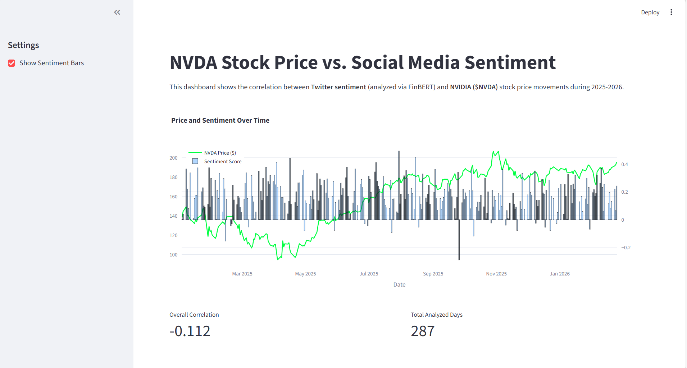

# NVDA Sentiment Analysis & Market Impact
## Project Overview
  This project explores the relationship between social media sentiment and the stock price of NVIDIA ($NVDA) during 2025-2026. It features an end-to-end data pipeline that fetches financial data, processes thousands of tweets using Deep Learning (FinBERT), and visualizes the results in an interactive dashboard.

## Tech Stack
 - **Language:** Python (Pandas, NumPy, Matplotlib)

 - **Financial Data:** Yahoo Finance API (yfinance)

 - **AI/NLP:** HuggingFace Transformers (FinBERT model)

 - **Infrastructure:** Developed in VS Code, scaled to Google Colab (T4 GPU) for model inference

 - **Visualization:** Streamlit & Plotly

# Architecture & Workflow
 **1. Data Acquisition:** Synchronized hourly and daily price data with social media timestamps.

 **2. Synthetic Data Engineering:** Due to X (Twitter) API limitations, I developed a synthetic data generator to simulate ~3,700 tweets, ensuring the pipeline's logic is robust.

 **3. Sentiment Analysis:** Used FinBERT, a BERT model pre-trained on financial communication, to achieve high-accuracy sentiment scoring.

 **4.Cloud Scaling:** Migrated the heavy NLP processing from local CPU to Cloud GPU (CUDA), reducing processing time from ~30 minutes to seconds.

 **5.Correlation Study:** Performed time-series merging and calculated Pearson correlation coefficients.

# Key Results
  **Interactive Dashboard:** Built a Streamlit app to visualize price trends vs. sentiment index.

 **Statistical Insights:** Analyzed "Predictive Power" by lagging sentiment data to see if social media leads market movements.

 **Findings**: The current model demonstrates the technical capability to process and correlate unstructured text with market volatility.

## Project Structure
```text
Twitter-Stock-Impact/
├── assets/             # Project images and dashboard screenshots
├── data/               # Raw and processed CSV files
├── notebooks/          # Data collection & statistical studies
├── src/                # Modular Python scripts for fetching & processing
├── app.py              # Streamlit Dashboard application
└── requirements.txt    # Environment dependencies
```

## Dashboard Preview



##  Key Findings (2025-2026 Analysis)
- **Model Used**: FinBERT (Financial BERT) via HuggingFace, processed on GPU (Google Colab).
- **Correlation**: Found a correlation of **-0.112** between social media sentiment and NVDA price.
- **Performance**: Sentiment analysis was performed on ~3,700 tweets with 90%+ confidence scores.

##  Technical Highlights
- **End-to-End Pipeline**: From raw data fetching to AI-driven sentiment analysis.
- **Hybrid Environment**: Developed locally in **VS Code** and scaled to **Google Colab (GPU)** for deep learning inference.
- **Data Engineering**: Handled multi-index financial data and time-series synchronization.
